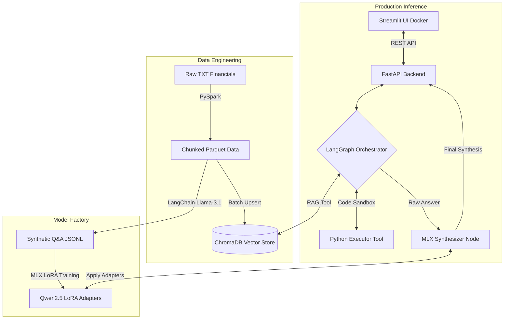

# Agentic MLOps Finance Pipeline


<details>
  <summary><strong>Table of Contents</strong></summary>
  <ol>
    <li><a href="#introduction">Introduction</a></li>
    <li><a href="#architecture-workflow">Architecture & Workflow</a></li>
    <li><a href="#prerequisites">Prerequisites</a></li>
    <li><a href="#installation">Installation</a></li>
    <li><a href="#usage-pipeline">Usage Pipeline</a></li>
    <li><a href="#project-structure">Project Structure</a></li>
  </ol>
</details>

## Introduction

This repository demonstrates a complete, end-to-end **Agentic MLOps** lifecycle for financial analysis. It moves beyond standard RAG by introducing distributed data engineering, synthetic dataset generation, local LLM fine-tuning, and a dual-model autonomous agent exposed via a containerized UI.

**Core Capabilities**:
- **Distributed Data Engineering:** Uses **PySpark** to process and chunk raw financial text into highly compressed Parquet files and ingest them into ChromaDB.
- **Synthetic Data Generation:** Leverages Llama-3.1 (Teacher Model) to generate high-quality instruction-tuning datasets (Q&A pairs) from financial contexts.
- **Local LoRA Fine-Tuning:** Uses Apple's **MLX** framework to fine-tune a lightweight Qwen2.5-0.5B model directly on Apple Silicon Unified Memory to act as a "Tone Synthesizer".
- **Dual-Model Agentic Graph:** Uses **LangGraph** to orchestrate Llama-3.1 (the "Brain/ReAct Agent") which writes Python code and queries databases, feeding its output to the locally fine-tuned Qwen model (the "Synthesizer") for stylistic refinement.
- **Microservices Deployment:** Features a FastAPI backend serving the LangGraph pipeline, paired with a Dockerized **Streamlit** frontend.

## Architecture Workflow



## Prerequisites
- Apple Silicon Mac recommended for MLX local training and unified memory inference.
- Python 3.11
- Java (Required for PySpark)
- Docker Desktop or OrbStack
- A valid **Groq API Key**

## Installation

1.  **Clone the repository:**
    ```bash
    git clone https://github.com/marcolacagnina/agentic-mlops-finance.git
    cd agentic-mlops-finance/
    ```

2.  **Create a virtual environment (recommended)**
    ```bash
    python3 -m venv venv
    source venv/bin/activate
    ```

3.  **Install dependencies:**
    ```bash
    pip install -r requirements.txt
    ```
    
4.  **Environment Variables:**
    Create a `.env` file in the root directory:
    ```bash
    GROQ_API_KEY=gsk_your_api_key_here
    ```

## Usage Pipeline
This project is designed to be executed sequentially to mimic a real MLOps lifecycle.

1. Data Engineering (PySpark)
Process the raw data and build the Vector DB:
```bash
python -m src.spark_pipeline.ingest_spark
python -m src.spark_pipeline.load_chroma
```

2. Model Factory (Synthetic Data & MLX Training)
Generate the training dataset and fine-tune the local model:
```bash
python -m src.dataset_gen.generate_dataset
python -m src.model_training.prepare_lora_dataset

# Train the model locally using MLX
mlx_lm.lora \
  --model mlx-community/Qwen2.5-0.5B-Instruct-4bit \
  --train \
  --data data/processed \
  --iters 200 \
  --batch_size 1 \
  --adapter-path data/adapters

# Test the newly trained model
python -m src.model_training.test_lora
```

3. Production Deployment (API & UI)
Run the hybrid infrastructure:

**Terminal 1 (Native Mac - Backend):**
```bash
python api.py
```
**Terminal 2 (Docker - Frontend):**
```bash
docker-compose up -d --build
```
Access the UI at `http://localhost:8501`.

## Project Structure 
```bash
agentic-mlops-finance/
├── data/
│   ├── raw/                 # Raw financial TXT reports
│   ├── processed/           # Parquet chunks and JSONL datasets
│   └── adapters/            # MLX LoRA trained weights
├── src/
│   ├── spark_pipeline/      # PySpark ingestion scripts
│   ├── dataset_gen/         # Synthetic data generation logic
│   ├── model_training/      # MLX data formatting and testing
│   └── production/
│       ├── pipeline.py      # Dual-model LangGraph integration
│       ├── graph.py         # Llama-3.1 ReAct Orchestrator
│       └── tools.py         # ChromaDB & Python tools
├── chroma_db/               # Persistent Vector Store
├── app.py                   # Streamlit Frontend UI
├── api.py                   # FastAPI Backend
├── Dockerfile.ui            # Docker configuration for Streamlit
└── docker-compose.yml       # Orchestration for microservices
```

