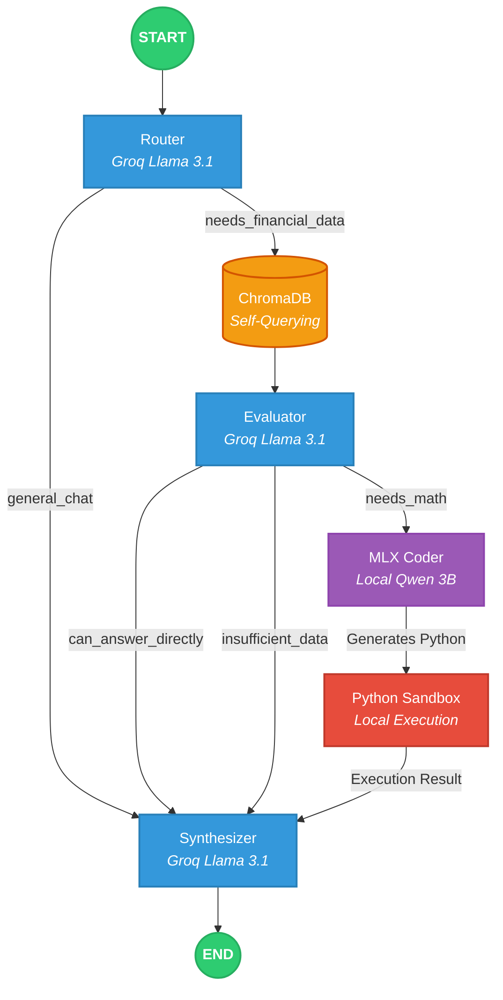

# Agentic Auditor


## Introduction

This repository demonstrates a complete, end-to-end **Agentic MLOps** lifecycle for financial auditing. It moves beyond standard RAG by introducing distributed data engineering, synthetic dataset generation, local LLM fine-tuning, and a strict multi-agent architecture to prevent mathematical hallucinations.

**Core Capabilities**:
- **Distributed Data Engineering:** Uses **PySpark** to process raw financial text. Implements custom context-aware chunking (Header Injection) to preserve tabular structures before saving to Parquet files and ChromaDB.
- **Agentic Distillation:** Leverages Llama-3.1 (Teacher Model via Groq) to autonomously generate an instruction-tuning dataset containing complex Chain-of-Thought reasoning and Python code execution paths.
- **Efficient Fine-Tuning:** Uses Apple's **MLX** framework to natively fine-tune a **Qwen2.5-Coder-3B** model in 4-bit precision on Apple Silicon Unified Memory.
- **Hybrid Edge-Cloud Orchestration:** Uses **LangGraph** to route traffic. A cloud model (Groq/Llama) acts as a strict Router/Evaluator to prevent hallucinations, while the locally fine-tuned MLX model handles deterministic Python code generation and execution in a sandbox.

## Key Engineering Highlights
*   **Self-Querying RAG:** Implemented Metadata filtering (Ticker extraction) pre-retrieval to avoid "context poisoning" across different companies' financial reports.
*   **Strict Persona Alignment:** The Evaluator node strictly checks if the context contains both the requested *entity* and *metric*. If missing, it overrides the LLM's generic fallback with a strict corporate apology, preventing out-of-domain hallucinations.
*   **Code Sandbox Execution:** The local model writes Python code that is physically executed on the machine, extracting exact percentages and margins rather than relying on the LLM's flawed internal math.

## Compound AI System Architecture

The agent follows a strictly routed Directed Acyclic Graph (DAG) to optimize execution costs and guarantee data accuracy.



## Prerequisites
- Apple Silicon Mac (M1/M2/M3) with at least 16GB RAM for MLX local training.
- Python 3.11
- Java (Required for PySpark)
- A valid **Groq API Key**

## Setup environment
```bash
git clone https://github.com/marcolacagnina/Agentic-Auditor.git
cd Agentic-Auditor/
python3 -m venv venv
source venv/bin/activate
pip install -r requirements.txt

# Create .env file
echo "GROQ_API_KEY=your_key_here" > .env
```

## Usage Pipeline
This project is designed to be executed sequentially to mimic a real MLOps lifecycle.

1. Data Engineering (PySpark)
Process the raw data and build the Vector DB:
```bash
python -m src.spark_pipeline.ingest_spark
python -m src.spark_pipeline.load_chroma
```

2. Model Factory (Synthetic Data & MLX Training)
Generate the Distillation dataset and fine-tune the local coder model:
```bash
python -m src.dataset_gen.generate_dataset
python -m src.model_training.prepare_lora_dataset

# Train the model locally using MLX (Qwen 3B Coder)
mlx_lm.lora \
  --model mlx-community/Qwen2.5-Coder-3B-Instruct-4bit \
  --train \
  --data data/processed \
  --iters 100 \
  --batch-size 1 \
  --num-layers 16 \
  --learning-rate 2e-5 \
  --max-seq-length 4096

# Test the newly trained weights
python -m src.model_training.test_lora
```

3. Production UI
Run the Agentic Workflow via Streamlit (Native execution recommended for MLX unified memory access):
```bash
streamlit run app.py
```

## Project Structure 
```bash
agentic-mlops-finance/
├── data/
│   ├── raw/                 # Raw financial TXT reports
│   ├── processed/           # Parquet chunks and JSONL datasets
├── adapters/                # MLX LoRA trained weights (generated locally)
├── src/
│   ├── spark_pipeline/      # PySpark ingestion & custom parsing
│   ├── dataset_gen/         # Synthetic Agentic Distillation logic
│   ├── model_training/      # MLX formatting and Code-Execution tests
│   └── production/
│       ├── graph.py         # LangGraph Compound AI logic
│       └── tools.py         # ChromaDB Self-Querying & Sandbox tools
├── chroma_db/               # Persistent Vector Store
└── app.py                   # Streamlit Frontend UI
```
